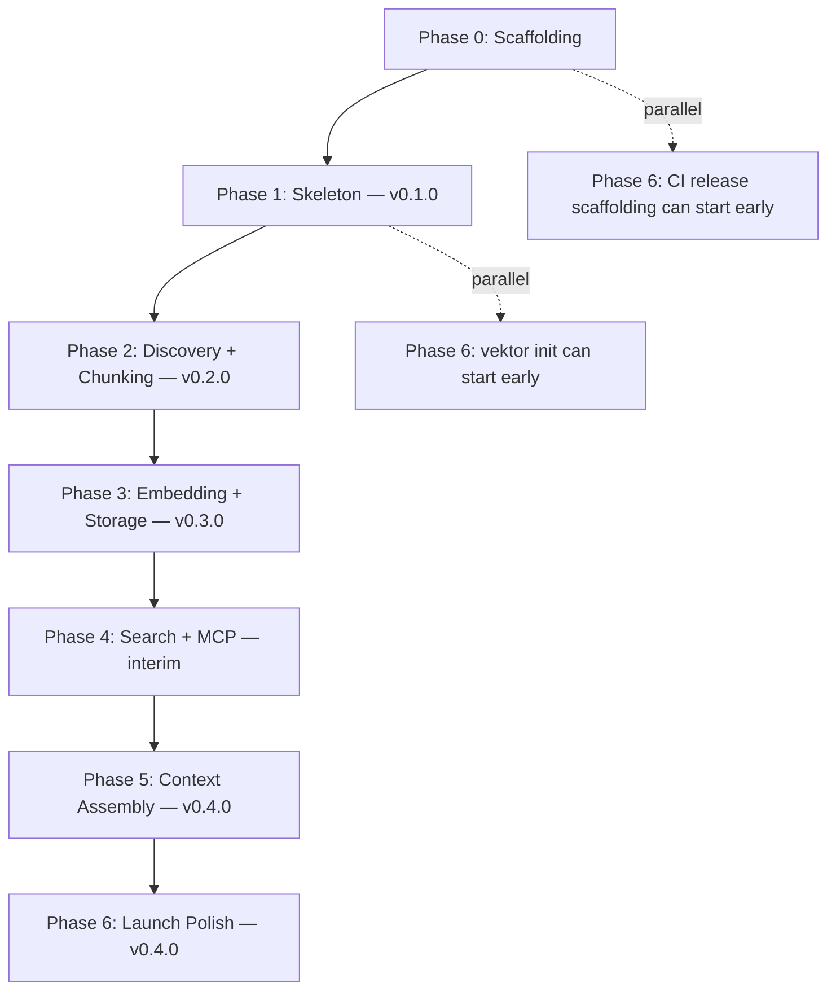
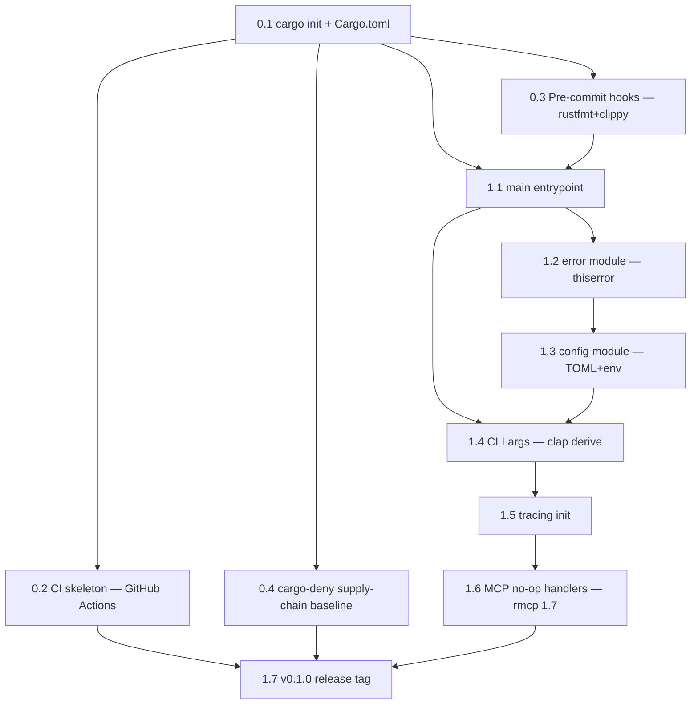

# DEPENDENCIES.md — Task DAG

> Machine-readable dependency graph for all tasks in `docs/plans/initial/`.
> Update when tasks are added, split, or re-sequenced.

---

## Reading this document

- **`Depends on`**: tasks that must complete (✅) before this one can start
- **`Blocks`**: tasks that cannot start until this one completes
- Tasks marked `🟢` are **currently unblocked** and ready to execute
- Tasks marked `🟡` are **blocked** by an in-flight or pending task
- Tasks marked `✅` are **done** (commit hash recorded in phase README)

---

## Phase-level DAG (Mermaid)



Phases are mostly sequential — each release tag depends on the previous tag's code landing. Two items in Phase 6 (`vektor init` and CI release pipeline) can be drafted in parallel with later phases since they don't depend on the engine internals.

---

## Phase 0 → Phase 1 detailed DAG



---

## Per-task dependency table

### Phase 0 — Scaffolding

| Task | Depends on | Blocks | Status |
|---|---|---|---|
| 0.1 cargo init + Cargo.toml | (none) | 0.2, 0.3, 0.4, 1.1 | ✅ `a3a2c2a` |
| 0.2 CI skeleton | 0.1 | 1.7 | 🟢 (unblocked; needs GitHub remote setup before dispatch) |
| 0.3 Pre-commit hooks | 0.1 | 1.1 | ✅ `689d5b2` |
| 0.4 cargo-deny baseline | 0.1 | 1.7 | ✅ `08361cc` |

### Phase 1 — Skeleton

| Task | Depends on | Blocks | Status |
|---|---|---|---|
| 1.1 main entrypoint | 0.1, 0.3 | 1.2, 1.4 | 🟡 |
| 1.2 error module | 1.1 | 1.3 | 🟡 |
| 1.3 config module | 1.2 | 1.4 | 🟡 |
| 1.4 CLI args | 1.1, 1.3 | 1.5 | 🟡 |
| 1.5 tracing init | 1.4 | 1.6 | 🟡 |
| 1.6 MCP no-op handlers | 1.5 | 1.7 | 🟡 |
| 1.7 v0.1.0 release | 0.2, 0.4, 1.6 | 2.* | 🟡 |

### Phase 2 — Discovery + Chunking (task list — per-task files TBD)

| Task | Depends on | Blocks | Status |
|---|---|---|---|
| 2.1 discover_files() | 1.7 | 2.2 | 🟡 |
| 2.2 HashStore + SQLite state.db | 2.1 | 2.7 | 🟡 |
| 2.3 language detection | 1.7 | 2.4 | 🟡 |
| 2.4 AST parse (tree-sitter) | 2.3 | 2.5 | 🟡 |
| 2.5 AST chunker (5 langs) + header preservation | 2.4 | 2.7 | 🟡 |
| 2.6 sliding-window fallback | 1.7 | 2.7 | 🟡 |
| 2.7 chunk_file() dispatcher | 2.5, 2.6 | 2.8 | 🟡 |
| 2.8 `--dump-chunks` CLI flag | 2.2, 2.7 | 2.9 | 🟡 |
| 2.9 v0.2.0 release | 2.8 | 3.* | 🟡 |

### Phase 3 — Embedding + Storage (task list — per-task files TBD)

| Task | Depends on | Blocks | Status |
|---|---|---|---|
| 3.1 Embedder trait | 2.9 | 3.2, 3.3, 3.4 | 🟡 |
| 3.2 OnnxEmbedder::new + warm-up | 3.1 | 3.5, 3.7 | 🟡 |
| 3.3 OnnxEmbedder::embed (tokenize+pool+norm) | 3.2 | 3.5, 3.7 | 🟡 |
| 3.4 OpenAiCompatEmbedder | 3.1 | 3.5 | 🟡 |
| 3.5 build_embedder() factory | 3.2, 3.3, 3.4 | 3.7 | 🟡 |
| 3.6 VectorStore::new (LanceDB Arrow schema) | 2.9 | 3.7, 3.8 | 🟡 |
| 3.7 VectorStore::reindex_file (delete-then-insert + chunk cache) | 3.5, 3.6 | 3.8 | 🟡 |
| 3.8 VectorStore::search (ANN query) | 3.6 | 3.9 | 🟡 |
| 3.9 VectorStore::delete_by_file | 3.6 | 3.7 | 🟡 |
| 3.10 SecretDetector + file-level skip list (B1.2/B1.5) | 2.1 | 3.7 | 🟡 |
| 3.11 `vektor models download` (B6.1) | 3.2 | 3.12 | 🟡 |
| 3.12 v0.3.0 release | 3.7, 3.10, 3.11 | 4.* | 🟡 |

### Phase 4 — Search + MCP (task list — per-task files TBD)

| Task | Depends on | Blocks | Status |
|---|---|---|---|
| 4.1 TextIndex::new (Tantivy schema) | 3.12 | 4.2 | 🟡 |
| 4.2 TextIndex::add_chunks | 4.1 | 4.3 | 🟡 |
| 4.3 TextIndex::search (BM25) | 4.2 | 4.5 | 🟡 |
| 4.4 rrf_fuse + AdaptiveWeights + SynonymExpander | 3.12 | 4.5 | 🟡 |
| 4.5 search_hybrid orchestrator | 3.8, 4.3, 4.4 | 4.6, 4.8 | 🟡 |
| 4.6 index_codebase orchestrator | 3.7, 4.2 | 4.7 | 🟡 |
| 4.7 MCP server bootstrap (rmcp 1.7 real handlers) | 1.6, 4.6 | 4.8 | 🟡 |
| 4.8 Tool handlers: index/search/get_context_for_prompt | 4.5, 4.7, 5.5 | 5.6 | 🟡 |

### Phase 5 — Context Assembly (task list — per-task files TBD)

| Task | Depends on | Blocks | Status |
|---|---|---|---|
| 5.1 TokenCounter (lang-specific + tiktoken-rs two-pass) | 4.5 | 5.5 | 🟡 |
| 5.2 Deduplicator (50% overlap threshold) | 4.5 | 5.5 | 🟡 |
| 5.3 RelatedExpander (chunk-level + tiered + hub-file skip) | 4.5 | 5.5 | 🟡 |
| 5.4 QueryCache (LRU + file-level invalidation) | 4.5 | 5.5 | 🟡 |
| 5.5 ContextAssembler orchestrator | 5.1, 5.2, 5.3, 5.4 | 4.8 | 🟡 |
| 5.6 handle_get_context_for_prompt | 4.8, 5.5 | 5.13 | 🟡 |
| 5.7 ShallowIndexer (two-tier) | 2.6, 4.1 | 5.8 | 🟡 |
| 5.8 IndexStatusTracker | 5.7 | 5.13 | 🟡 |
| 5.9 RecencyTracker + min-score gate | 4.5 | 5.5 | 🟡 |
| 5.10 SynonymExpander static map | 4.4 | (in 4.4) | 🟡 |
| 5.11 AdaptiveWeights | 4.4 | (in 4.4) | 🟡 |
| 5.12 WarmUp at server startup | 3.2 | 5.13 | 🟡 |
| 5.13 Stage-5 integration check | 5.6, 5.8, 5.12 | 6.* | 🟡 |

### Phase 6 — Launch Polish (task list — per-task files TBD)

| Task | Depends on | Blocks | Status |
|---|---|---|---|
| 6.1 `vektor init` MCP config writer | 4.7 | 6.5 | 🟡 |
| 6.2 Release pipeline (signed binaries + checksums) | 0.2, 1.7 | 6.5 | 🟢 (can start after 0.2) |
| 6.3 Lightweight benchmark gate (20 queries vs tokio) | 5.13 | 6.4 | 🟡 |
| 6.4 BENCHMARKS.md baseline | 6.3 | 6.5 | 🟡 |
| 6.5 v0.4.0 release tag | 5.13, 6.1, 6.2, 6.4 | (stage 3) | 🟡 |

---

## Critical path

The longest dependency chain (the project bottleneck):

```
0.1 → 1.1 → 1.2 → 1.3 → 1.4 → 1.5 → 1.6 → 1.7 → 2.1 → 2.2 → 2.7 → 2.8 → 2.9 →
3.1 → 3.2 → 3.3 → 3.5 → 3.7 → 3.12 → 4.1 → 4.5 → 5.5 → 5.6 → 5.13 → 6.5
```

That's **25 sequential tasks** on the critical path. Everything else parallelizes around them.

Tasks that can start early (off-critical-path, useful for parallel work):
- **0.2 / 0.3 / 0.4** after 0.1 lands (independent)
- **3.4 (OpenAI backend)** after 3.1, parallel with 3.2/3.3
- **3.10 (SecretDetector)** after 2.1, parallel with 2.2–2.9
- **3.11 (`vektor models download`)** after 3.2, parallel with 3.6–3.9
- **6.1 (`vektor init`)** after 4.7, parallel with most of Phase 5
- **6.2 (release pipeline)** after 0.2 + 1.7, parallel with all of Phases 2–5

---

## When to update this file

- **Adding a task**: insert row in the relevant phase table, update both DAG diagrams
- **Splitting a task**: replace one row with N rows, update Blocks of tasks that depended on the original
- **Reordering**: only allowed if neither task has shipped (status not ✅). Otherwise create a new task that fixes whatever's wrong post-hoc.
- **Marking ✅**: change the status emoji and update next-task statuses from 🟡 to 🟢 if they're now unblocked.

---

*This file is the single source of truth for "what's safe to work on next." When a phase README and this file disagree about a task's dependencies, this file wins.*
